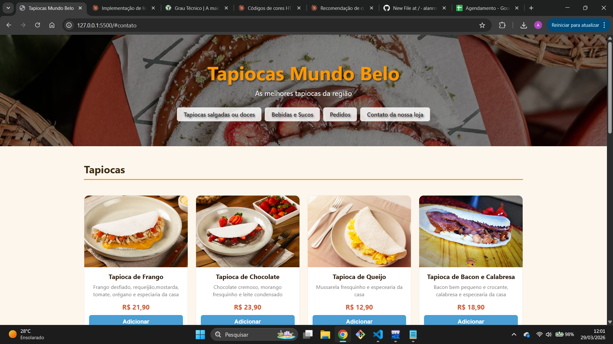

# 🫓 Tapiocas Mundo Belo — Cardápio Web

Site de cardápio digital para uma tapiocaria, com listagem de produtos, carrinho de pedidos e contato via WhatsApp.

🔗 **[Acesse o site aqui](https://alanrossinedev.github.io/CARDAPIO-WEB)**

---

## 📸 Preview



---

## 🚀 Funcionalidades

- Cardápio com tapiocas salgadas e doces
- Seção de bebidas
- Carrinho de pedidos com total automático
- Botão de finalizar pedido via WhatsApp
- Layout responsivo para mobile e desktop

---

## 🛠️ Tecnologias

- HTML5
- CSS3 (Flexbox, Grid, variáveis CSS)
- JavaScript puro (Vanilla JS)

---

## 📁 Estrutura do projeto

```
CARDAPIO-WEB/
├── index.html
├── style.css
├── script.js
└── images/
    ├── tapiocas-banner.avif
    ├── tapioca-de-frango.jpg
    ├── tapioca-de-chocolate1.webp
    ├── tapioca-queijo.jpg
    ├── tapioca-bacon-e-calabresa.jpeg
    ├── tapioca-ovo.jpg
    ├── refrigerante-lata.jpg
    ├── suco-natural.jpg
    └── agua1.png
```

---

## 💻 Como rodar localmente

```bash
# Clone o repositório
git clone https://github.com/alanrossinedev/CARDAPIO-WEB.git

# Acesse a pasta
cd CARDAPIO-WEB

# Abra o arquivo no navegador
start index.html
```

---

## 👨‍💻 Desenvolvedor

Feito por **Alan Rossini**

[](https://github.com/alanrossinedev)
[](https://linkedin.com/in/alanrossine)

---

© 2026 Todos os direitos reservados
